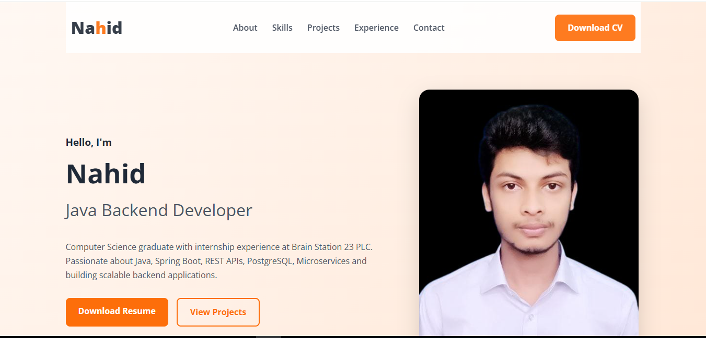

# 💼 Personal Portfolio Website

A modern, fully responsive personal portfolio website built with **HTML5, CSS3, and JavaScript** to showcase my skills, projects, education, and professional experience as a **Java Backend Developer**.

## 🌐 Live Demo

🔗 **Portfolio:** https://nahidworld.github.io/web-dev-portfolio/

---



# 📖 Overview

This portfolio serves as my personal website where recruiters, clients, and fellow developers can learn more about me, explore my projects, and get in touch.

The website is designed with a clean, modern interface and follows responsive design principles to ensure a great user experience across desktop, tablet, and mobile devices.

---

# ✨ Features

- 🎨 Modern and clean UI
- 📱 Fully responsive design
- ⚡ Fast loading and lightweight
- 🖼️ Hero section with profile image
- 👨‍💻 About Me section
- 💻 Technical Skills section
- 🚀 Featured Projects showcase
- 💼 Experience & Education timeline
- 📄 Download Resume button
- 📬 Contact section
- ✨ Smooth scrolling navigation
- 🎯 Scroll reveal animations
- 🌍 SEO-friendly structure

---

# 🛠️ Built With

- HTML5
- CSS3
- JavaScript (Vanilla JS)
- Font Awesome
- Google Fonts

---

# 📂 Project Structure

```text
portfolio/
│
├── index.html
├── style.css
├── script.js
│
├── images/
│   ├── nahid2.png
│   ├── projects/
│   │   ├── library-management.png
│   │   ├── thesis.png
│   │   └── ...
│   └── icons/
│
├── resume/
│   └── CV.pdf
│
└── README.md
```

---

# 📸 Screenshots

## Home Page

images/screenshots/home.png


## Projects Section

> Add a screenshot here

```
images/screenshots/projects.png
```

## Mobile View

> Add a screenshot here

```
images/screenshots/mobile.png
```

---

# 🚀 Featured Projects

### 📚 Library Management System

A backend application built with **Java Spring Boot** featuring:

- Authentication
- Book Management
- Borrow & Booking System
- Reviews
- PostgreSQL Database
- REST APIs

---

### 🩺 GI Disease Classification

An undergraduate research project focused on gastrointestinal disease classification using:

- Ensemble CNN
- CBAM
- SWA
- Test-Time Augmentation
- Kvasir-V2 Dataset

---

# 📱 Responsive Design

The website is optimized for:

- 💻 Desktop
- 💼 Laptop
- 📱 Mobile
- 📟 Tablet

---

# 🚀 Getting Started

Clone the repository

```bash
git clone https://github.com/Nahidworld/web-dev-portfolio
```

Navigate to the project

```bash
cd portfolio
```

Open `index.html` in your browser.

No additional dependencies or installation are required.

---

# 📬 Contact

**Md. Fahim Bin Imam Nahid**

📧 Email: mfbinahid@gmail.com

💼 LinkedIn: https://linkedin.com/in/fahimbinimam

💻 GitHub: https://github.com/nahidworld

🌐 Portfolio: https://nahidworld.github.io/web-dev-portfolio/

---

# 📄 License

This project is licensed under the MIT License.

Feel free to fork this repository and customize it for your own personal portfolio.

---

## ⭐ Support

If you found this project helpful, please consider giving it a ⭐ on GitHub. It helps others discover the project and supports my work.
